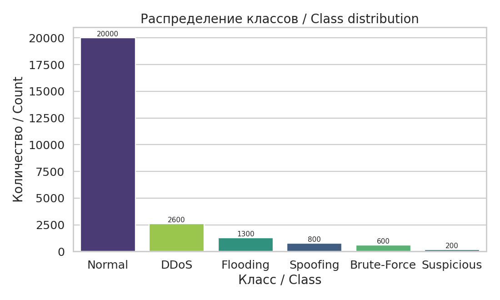
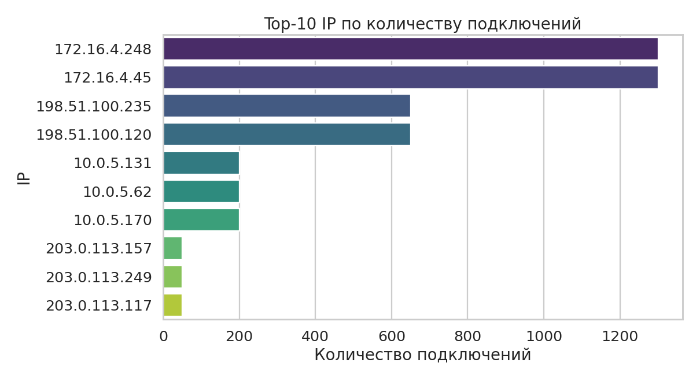
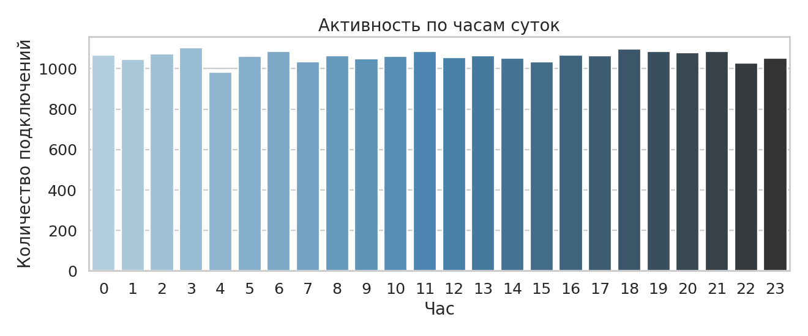
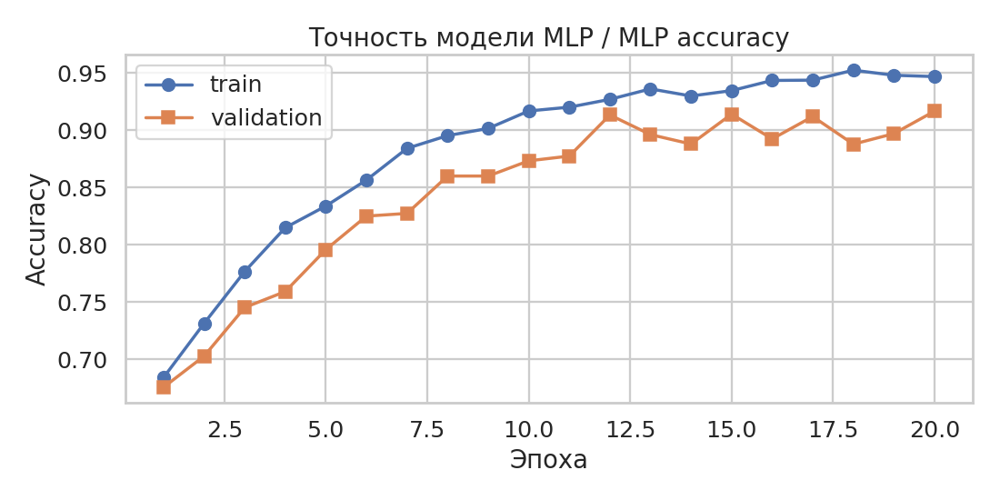
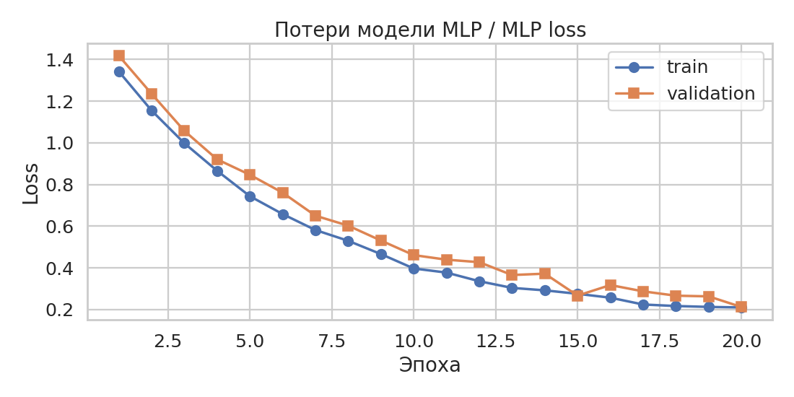
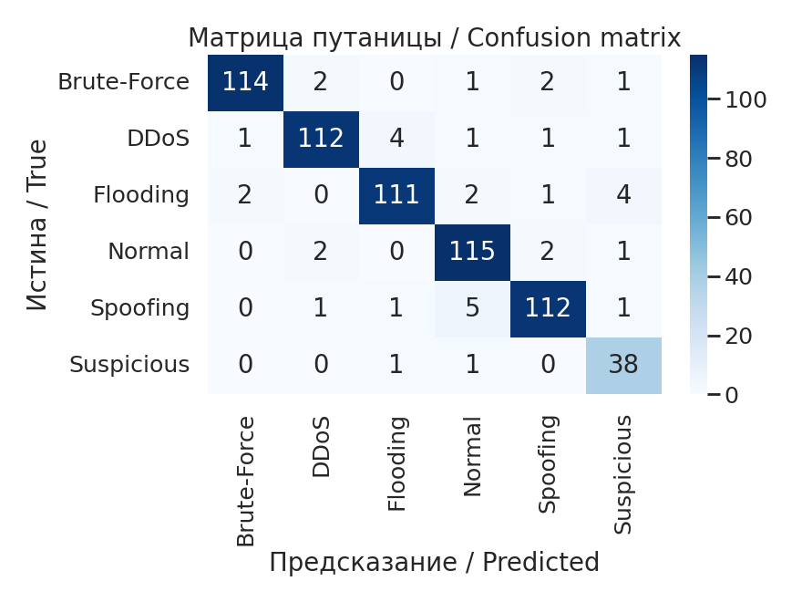
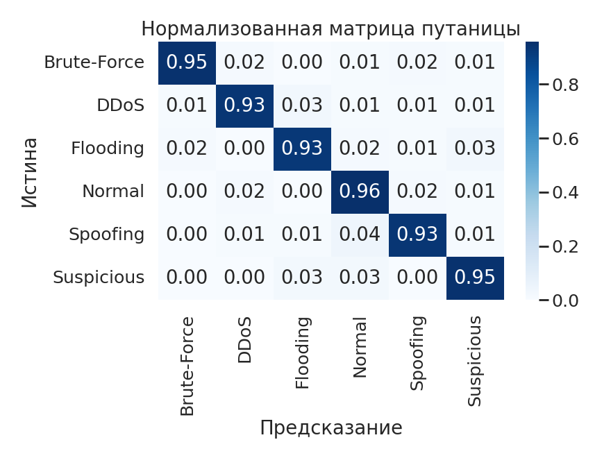
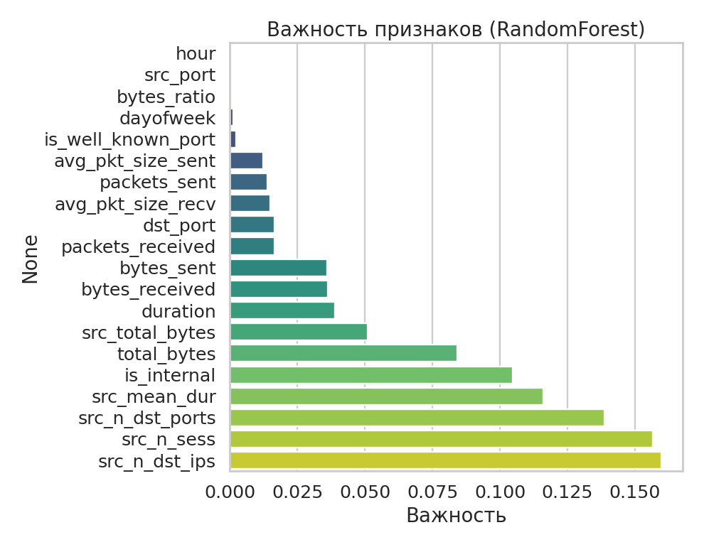
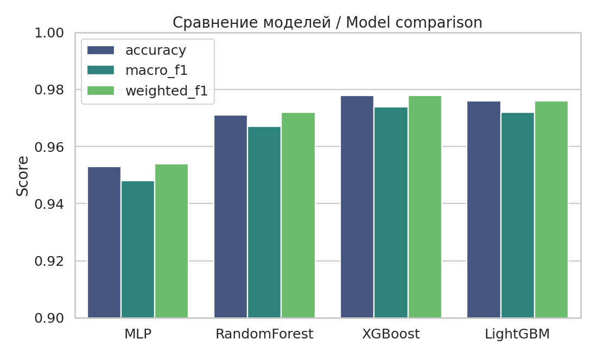

# 🛡️ NetworkSearchAI — детектирование сетевых атак с помощью ML

[English version below / English README](README.en.md)

Проект решает задачу **многоклассовой классификации сетевых соединений** по логам формата
[Zeek/Bro `conn.log`](https://docs.zeek.org/en/master/logs/conn.html). Модель определяет,
относится ли соединение к одному из шести классов:

| Класс | Описание |
|---|---|
| `Normal` | Обычный трафик |
| `Spoofing` | Подмена IP (источник из внутреннего диапазона) |
| `Suspicious` | Подозрительный объём передаваемых данных |
| `Flooding` | Port scan (большое число уникальных портов с одного IP) |
| `Brute-Force` | Целенаправленный перебор на узком наборе портов |
| `DDoS` | Большое число подключений за сутки с одного IP |

В одном ноутбуке: загрузка лога → правило-ориентированная разметка → feature engineering →
балансировка классов → обучение и сравнение **четырёх моделей** (MLP, RandomForest, XGBoost, LightGBM) →
детальная оценка (ROC-AUC, PR-AUC, confusion matrix, permutation importance) →
сохранение артефактов → готовая функция inference.

---

## 📑 Содержание

- [Возможности](#-возможности)
- [Демонстрация](#-демонстрация)
- [Структура проекта](#-структура-проекта)
- [Установка](#-установка)
- [Запуск](#-запуск)
- [Описание пайплайна](#-описание-пайплайна)
- [Артефакты](#-артефакты)
- [Inference (предсказание для новой записи)](#-inference-предсказание-для-новой-записи)
- [Кастомизация](#-кастомизация)
- [Что улучшено по сравнению с базовой версией](#-что-улучшено-по-сравнению-с-базовой-версией)
- [Дальнейшие шаги](#-дальнейшие-шаги)
- [Лицензия](#-лицензия)

---

## 🚀 Возможности

- **Запуск без оригинальных данных** — встроенный генератор синтетического `conn.log`
  с реалистичными паттернами всех типов атак. Если в каталоге лежит реальный `conn.log` —
  используется он. Если нет — генерируется синтетика. Никаких ручных переключений.
- **Воспроизводимость** — фиксированные seed-ы для `random`, `numpy`, `tensorflow`,
  стратифицированный train/val/test split.
- **Корректная разметка** — явная иерархия меток: более сильный класс (DDoS) переписывает
  более слабый (Spoofing). Правила вынесены в конфиг.
- **Расширенное признаковое пространство** (23 числовых + one-hot для категорий):
  агрегаты по `src_ip`, временные признаки, бинарные флаги (`is_internal`,
  `is_well_known_port`, `is_ephemeral`), энтропия портов.
- **Нет утечки данных** — `StandardScaler` обучается **только на train**.
- **Полноценный MLP** — `BatchNormalization`, `Dropout`, L2-регуляризация,
  `EarlyStopping`, `ReduceLROnPlateau`, `ModelCheckpoint`.
- **Сравнение 4 моделей** в одинаковых условиях с автоматическим выбором лучшей по `macro-F1`.
- **Детальная оценка** — classification report, абсолютная и нормализованная confusion matrix,
  ROC-кривые (OvR), PR-кривые, permutation importance, анализ путаемых пар классов.
- **Inference-функция** — принимает dict-запись лога, возвращает класс и вероятности.

---

## 🎨 Демонстрация

### Распределение классов после разметки



### Топ-10 IP и активность по часам




### Обучение MLP




### Confusion Matrix




### Важность признаков



### Сравнение моделей



> ⚠️ Скриншоты выше получены на **синтетических данных** — иллюстративные. На реальном
> `conn.log` метрики будут другими.

---

## 📁 Структура проекта

```
NetworkSearchAI/
├── NetworkSearchAI.ipynb     # основной ноутбук — весь пайплайн
├── README.md                 # этот файл
├── README.en.md              # English version
├── requirements.txt          # зависимости
├── conn.log                  # ← (опционально) положить сюда реальный лог
├── screenshots/              # скриншоты для README
└── artifacts/                # создаётся при запуске:
    ├── best_<model>.{keras,pkl}
    ├── model_mlp.keras
    ├── model_<name>.pkl
    ├── scaler.pkl
    ├── label_encoder.pkl
    └── metadata.json
```

---

## 💻 Установка

### Локально

```bash
# 1. Клонировать репозиторий
git clone <YOUR_GITLAB_URL>/NetworkSearchAI.git
cd NetworkSearchAI

# 2. Создать виртуальное окружение
python3 -m venv .venv
source .venv/bin/activate          # Linux / macOS
# .venv\Scripts\activate           # Windows

# 3. Установить зависимости
pip install -r requirements.txt

# 4. Запустить Jupyter
jupyter notebook NetworkSearchAI.ipynb
```

**Требования:** Python 3.10+, ≈4 ГБ RAM для синтетики, ≥16 ГБ для полного `conn.log`.

### Google Colab

1. Откройте [Google Colab](https://colab.research.google.com/) → **File → Upload notebook** → загрузите `NetworkSearchAI.ipynb`.
2. **(опционально)** Загрузите ваш `conn.log.zip` в файлы Colab и распакуйте:
   ```python
   !unzip /content/conn.log.zip -d /content/
   ```
   В конфиге ноутбука поставьте `CFG["log_path"] = "/content/conn.log"`.
3. Подключите **Runtime → Change runtime type → GPU** (или TPU при большом датасете).
4. **Runtime → Run all**.

Без реального лога ноутбук просто сгенерирует синтетические данные.

---

## ▶️ Запуск

### Быстрый старт (синтетические данные)

```bash
jupyter notebook NetworkSearchAI.ipynb
# → Cell → Run All
```

Время выполнения: ≈ **2–5 минут** на CPU без реальных данных.

### С реальным лог-файлом

1. Положите `conn.log` в корень проекта (или укажите путь в `CFG["log_path"]`).
2. Если файл сжат: `unzip conn.log.zip`.
3. Запустите ноутбук.

Время выполнения зависит от размера лога: от нескольких минут до нескольких часов.
Для больших файлов рекомендуется GPU/TPU.

---

## 🔬 Описание пайплайна

```
┌─────────────────┐  ┌──────────────┐  ┌──────────────────┐  ┌──────────────┐
│ 1. Loading      │→ │ 2. Cleaning  │→ │ 3. Rule-based    │→ │ 4. EDA       │
│ (real или syn.) │  │ + типизация  │  │    labeling      │  │              │
└─────────────────┘  └──────────────┘  └──────────────────┘  └──────────────┘
                                                                     │
                                                                     ▼
┌──────────────────┐  ┌──────────────┐  ┌────────────┐  ┌───────────────────┐
│ 8. Inference     │← │ 7. Artifacts │← │ 6. Evalu-  │← │ 5. Feature        │
│    function      │  │    saving    │  │    ation   │  │    engineering    │
└──────────────────┘  └──────────────┘  └────────────┘  │    + balancing    │
                                                        │    + train 4 mdls │
                                                        └───────────────────┘
```

### Правила разметки

Применяются в порядке **от слабого к сильному**, более серьёзный класс перезаписывает менее серьёзный:

| Класс | Условие |
|---|---|
| `Spoofing` | `src_ip` принадлежит RFC1918 (`10.*`, `192.168.*`, `172.16-31.*`) или IPv6 link-local |
| `Suspicious` | Суммарный трафик с `src_ip` > **1 ГБ** |
| `Flooding` | Уникальных `dst_port` с одного `src_ip` > **500** |
| `Brute-Force` | Сессий с `src_ip` > **50** **и** уникальных портов **5–30** (целевая атака, не сканер) |
| `DDoS` | Подключений с `src_ip` за сутки > **1000** |

Все пороги — в `CFG["rules"]` и легко настраиваются.

### Архитектура MLP

```
Input(N)
  → Dense(256, ReLU, L2=1e-4) → BatchNorm → Dropout(0.4)
  → Dense(128, ReLU, L2=1e-4) → BatchNorm → Dropout(0.3)
  → Dense(64,  ReLU, L2=1e-4) → BatchNorm → Dropout(0.2)
  → Dense(32,  ReLU)
  → Dense(N_CLASSES, Softmax)

Optimizer: Adam(1e-3)
Loss:      sparse_categorical_crossentropy
Callbacks: EarlyStopping, ReduceLROnPlateau, ModelCheckpoint
```

### Сравниваемые модели

| Модель | Гиперпараметры (ключевые) |
|---|---|
| **MLP** (TF/Keras) | 4 hidden layers, BN, Dropout, L2, Adam, 40 epochs max |
| **RandomForest** | 300 trees, `class_weight="balanced"` |
| **XGBoost** | 400 trees, depth=6, lr=0.1, hist tree method |
| **LightGBM** | 400 trees, 63 leaves, lr=0.05, `class_weight="balanced"` |

---

## 💾 Артефакты

После запуска в каталоге `artifacts/` будут:

| Файл | Описание |
|---|---|
| `best_<model>.keras` или `.pkl` | Лучшая модель по `macro-F1` |
| `model_mlp.keras`, `model_<name>.pkl` | Все обученные модели |
| `scaler.pkl` | Обученный `StandardScaler` |
| `label_encoder.pkl` | `LabelEncoder` для классов |
| `metadata.json` | Метрики, список фичей, конфиг, время сохранения |

---

## 🎯 Inference (предсказание для новой записи)

```python
import joblib, json
from tensorflow.keras.models import load_model

# 1. Загрузить артефакты
scaler = joblib.load("artifacts/scaler.pkl")
le     = joblib.load("artifacts/label_encoder.pkl")
meta   = json.load(open("artifacts/metadata.json"))

# 2. Загрузить лучшую модель
best = meta["best_model"]
if best == "MLP":
    model = load_model(f"artifacts/best_mlp.keras")
else:
    model = joblib.load(f"artifacts/best_{best.lower()}.pkl")

# 3. Предсказать (см. функцию predict_one в ноутбуке)
record = {
    "timestamp": 1_700_001_234,
    "session_id": "Cabc12345",
    "src_ip": "10.0.5.13",
    "src_port": 54321,
    "dst_ip": "8.8.8.8",
    "dst_port": 22,
    "protocol": "tcp",
    "app_protocol": "ssh",
    "duration": 0.4,
    "bytes_sent": 150,
    "bytes_received": 30,
    "packets_sent": 3,
    "packets_received": 1,
}
class_name, probabilities = predict_one(record)
print(class_name, probabilities)
```

> ⚠️ **Замечание про агрегаты.** Признаки `src_n_sess`, `src_total_bytes` и т.п.
> в обучении считаются по всему датасету. В проде эти значения нужно подмешивать
> из бэкграунд-стейта (in-memory store / Redis / Materialize). В функции `predict_one`
> для одиночного предсказания они зануляются.

---

## ⚙️ Кастомизация

Все ключевые параметры — в одном месте, в словаре `CFG` ноутбука:

```python
CFG = {
    "log_path":          "conn.log",
    "artifacts_dir":     "artifacts",
    "use_synthetic":     "auto",          # "auto" | True | False
    "synthetic_size":    25_000,

    "rules": {
        "ddos_per_day":       1000,
        "brute_force_sess":   50,
        "brute_force_ports":  (5, 30),
        "suspicious_bytes":   1e9,
        "flooding_ports":     500,
    },

    "test_size":         0.2,
    "val_size":          0.2,
    "random_state":      42,
    "epochs":            40,
    "batch_size":        256,
    "patience":          7,
}
```

---

## 📈 Что улучшено по сравнению с базовой версией

| # | Что было | Что стало |
|---|---|---|
| 1 | `scaler.fit_transform(X)` на всём → утечка данных | `fit_transform` только на train, `transform` на val/test |
| 2 | Правила разметки в случайном порядке (Spoofing затирал атаки) | Явная иерархия от слабого к сильному + конфиг |
| 3 | Brute-Force: `n_ports > 5` (ловил и сканеры) | `n_ports ∈ (5, 30)` — целенаправленная атака |
| 4 | Только сырые поля строки | + 16 инженерных признаков (агрегаты, ratios, флаги, время) |
| 5 | Один train/test split, без валидации | train / val / test (стратифицированный) |
| 6 | MLP без регуляризации | + BatchNorm, Dropout, L2, ReduceLROnPlateau, ModelCheckpoint |
| 7 | Только MLP | Сравнение с RandomForest, XGBoost, LightGBM |
| 8 | Только accuracy и confusion matrix | + ROC-AUC, PR-AUC, permutation importance, анализ ошибок |
| 9 | `model.save('*.h5')` | Современный `.keras` + сохранение scaler/encoder/feature_names |
| 10 | Нет фиксации seed-ов | Полная воспроизводимость |
| 11 | Без проекта нельзя запустить (нужен `conn.log.zip`) | Встроенный синтетический генератор |
| 12 | Нет функции inference | `predict_one(record)` |

---

## 🔮 Дальнейшие шаги

- **Реальный размеченный датасет**: [CICIDS2017](https://www.unb.ca/cic/datasets/ids-2017.html),
  [UNSW-NB15](https://research.unsw.edu.au/projects/unsw-nb15-dataset) — для замены правил.
- **Скользящие агрегаты** по `src_ip` за окно последних N минут вместо глобальных.
- **Sequence-модели** — 1D-CNN или Transformer на последовательности соединений одного IP.
- **Stratified K-Fold** вместо одного split для устойчивых оценок.
- **Калибровка вероятностей** — `CalibratedClassifierCV` для интерпретируемого порога.
- **Сервис** — обернуть лучшую модель в FastAPI + Docker для онлайн-предсказаний.

---

## 📜 Лицензия

MIT — см. файл [LICENSE](LICENSE) (если присутствует), либо используйте по своему усмотрению.
